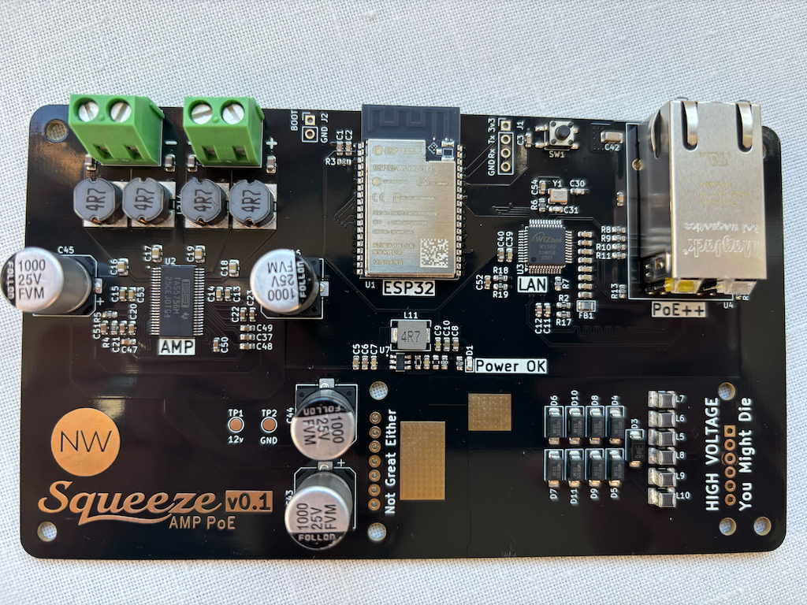

# SqueezeAMP PoE

`SqueezeAMP PoE` is an amplifier driven by an ESP32 designed to run [squeezelite-esp32](https://github.com/sle118/squeezelite-esp32), powered by PoE++.

Features:

* Power over Ethernet 802.3bt 60W (PoE++)
* ESP32 WROOM 4MB Flash 8MB PSRAM
* TAS5756 Amplifier capable of driving stereo 30W 8Ohm speakers

## Why

The position of speakers is often not optimal for WiFi, leading to unreliable music streaming. Adding 100Mb ethernet allows
more reliable connections with ample bandwidth. Given an ethernet connection, PoE is able to provide power for the device.

The schematic is inspired by the [SqueezeAMPagain](https://github.com/hallo-alex/SqueezeAMPagain).

## Configuration

Install [squeezelite-esp32](https://github.com/sle118/squeezelite-esp32). The simplest method is to use the [installer](https://sle118.github.io/squeezelite-esp32-installer/).

Set the following configuration via the NVS Editor to configure:

dac_config: `model=TAS57xx,bck=33,ws=25,do=32,sda=27,scl=26,mute=4:0`
eth_config: `model=w5500,cs=15,speed=20000000,intr=18,rst=19`
spi_config: `mosi=13,clk=14,host=1,miso=12,dc=-1`
set_GPIO:   `2=spkfault`

## PCB Fabrication and Assembly by PCBWay

I am proudly sponsored by [PCBWay](https://www.pcbway.com/), a leading manufacturer specializing in PCB prototyping, 
low-volume production, and PCB Assembly services. Thanks to PCBWay’s sponsorship, I was able to fabricate and assemble 
my PCBs with high precision and quality. Their advanced manufacturing capabilities ensured that our design was 
translated into a robust and functional product.

[//]: # (![board image]&#40;assets/pcb.png&#41;)

### Why PCBWay?

PCBWay offers:

* **High-quality PCB fabrication** with multiple layer options, surface finishes, and material choices.
* **Fast turnaround times** to meet project deadlines efficiently.
* **Affordable pricing** for both prototyping and mass production.
* **Reliable PCB assembly services**, including SMT, through-hole, and mixed assembly.
* **Exceptional customer support** and a user-friendly ordering platform.

### Get Your Own PCBs from PCBWay

I highly recommend PCBWay for all your PCB fabrication and assembly needs. Their dedication to quality and customer 
satisfaction makes them an ideal partner for your projects. If you're looking for a trusted partner for PCB fabrication 
and assembly, check out PCBWay for your next project.

Special thanks to PCBWay for their generous support!

## Changelog

#### v0.1.0

* Initial schematic and board
